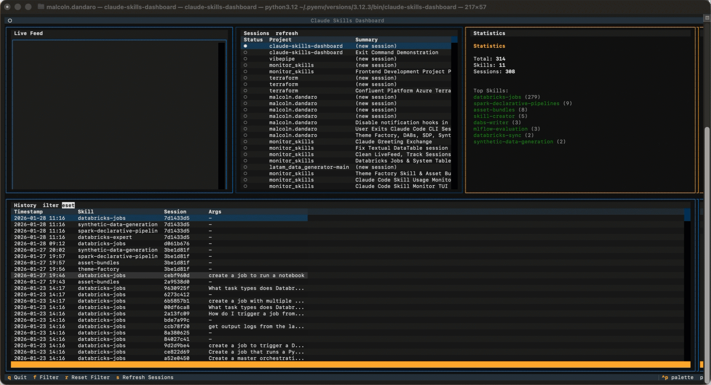

# Claude Skills Dashboard

A beautiful TUI (Terminal User Interface) dashboard for monitoring and analyzing Claude Code skill usage in real-time.


## Features

- **Live Feed**: Watch skill invocations as they happen in real-time
- **Session Tracking**: Monitor active Claude Code sessions across all projects
- **Statistics Panel**: View aggregated usage statistics and top skills
- **History Table**: Browse and filter all historical skill invocations
- **Keyboard Navigation**: Full keyboard support for efficient navigation

## Screenshots



## Requirements

- Python 3.10 or higher
- Claude Code CLI with skill tracking enabled

## Installation

### Quick Install (recommended)

Install everything — the tracking hook and the dashboard — with a single command:

```bash
curl -fsSL https://raw.githubusercontent.com/malcolndandaro/claude-skills-dashboard/main/setup.sh | bash
```

This will:

1. Verify prerequisites (Python 3.10+, pip, jq)
2. Install the skill tracking hook into `~/.claude/settings.json`
3. Install the `claude-skills-dashboard` package from GitHub

### From Source

```bash
git clone https://github.com/malcolndandaro/claude-skills-dashboard.git
cd claude-skills-dashboard
pip install -e .
```

## Setup

### Enable Skill Tracking Hook

If you used the quick install above, the hook is already configured. Otherwise, run the install script to set up the hook:

```bash
chmod +x install-hook.sh
./install-hook.sh
```

Or manually add the hook to your `~/.claude/settings.json`:

```json
{
  "hooks": {
    "Skill": [
      {
        "matcher": "",
        "hooks": [
          {
            "type": "command",
            "command": "echo '{\"timestamp\":\"'$(date -u +%Y-%m-%dT%H:%M:%SZ)'\",\"session\":\"'$CLAUDE_SESSION_ID'\",\"skill\":\"'$CLAUDE_SKILL'\",\"args\":'${CLAUDE_SKILL_ARGS:-null}',\"cwd\":\"'$PWD'\"}' >> ~/.claude/skill-tracking.jsonl"
          }
        ]
      }
    ]
  }
}
```

## Usage

```bash
# Run the dashboard
claude-skills-dashboard
```

### Key Bindings

| Key | Action |
|-----|--------|
| `q` | Quit |
| `f` | Open filter dialog |
| `r` | Reset filters |
| `s` | Refresh sessions |
| `Tab` / `Shift+Tab` | Switch between panels |
| `j` / `k` or arrows | Navigate tables |
| `Enter` | Select session (filters history) |

## Data Sources

The dashboard reads from two data sources:

1. **Skill Tracking** (`~/.claude/skill-tracking.jsonl`):
   ```json
   {"timestamp":"2026-01-23T14:12:19Z","session":"3aa3643b-...","skill":"asset-bundles","args":null,"cwd":"/path/to/project"}
   ```

2. **Session Metadata** (`~/.claude/projects/*/sessions-index.json`):
   - Scans all project directories for session information
   - Detects active sessions (modified within last 5 minutes)
   - Shows project name, summary, message count, and timestamps

## Architecture

```
claude_skills_dashboard/
├── __init__.py          # Package initialization
├── app.py               # Main Textual application
├── models.py            # Pydantic data models
├── reader.py            # JSONL parsing and session reading
├── stats.py             # Statistics computation
├── watcher.py           # File system monitoring (watchdog)
└── widgets/
    ├── __init__.py
    ├── live_feed.py     # Real-time feed widget
    ├── stats_panel.py   # Statistics display
    ├── sessions_panel.py # Session tracking
    └── history_table.py  # Filterable history table
```

## Dependencies

- [textual](https://textual.textualize.io/) - TUI framework
- [pydantic](https://pydantic.dev/) - Data validation
- [watchdog](https://python-watchdog.readthedocs.io/) - File system monitoring
- [python-dateutil](https://dateutil.readthedocs.io/) - Date parsing

## Contributing

Contributions are welcome! Please feel free to submit a Pull Request.

1. Fork the repository
2. Create your feature branch (`git checkout -b feature/amazing-feature`)
3. Commit your changes (`git commit -m 'Add amazing feature'`)
4. Push to the branch (`git push origin feature/amazing-feature`)
5. Open a Pull Request

## License

This project is licensed under the MIT License - see the [LICENSE](LICENSE) file for details.

## Acknowledgments

- Built with [Textual](https://textual.textualize.io/) by Textualize
- Designed for use with [Claude Code](https://claude.ai/claude-code) by Anthropic
